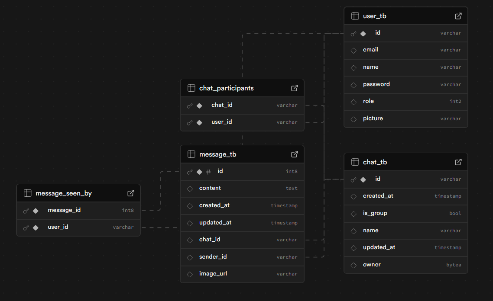

# 🚆 Trenchat


<p align="center">
  
  
  
  
  
  
  
  
</p>

O **Trenchat** é uma aplicação de chat em tempo real desenvolvida com **Spring Boot** para o backend e **React** para o frontend. Utilizando **WebSockets** com o protocolo **STOMP**, a plataforma permite comunicação instantânea entre usuários de forma simples, rápida e escalável. A interface, construída com **Ant Design**, é moderna, responsiva e intuitiva.

<p align="center">
  
</p>

## ✨ Funcionalidades

- 📡 **Mensagens em Tempo Real:** Comunicação instantânea via WebSockets.
- 💬 **Salas de Chat:** Suporte para múltiplas salas, tanto em grupo quanto privadas.
- 🔐 **API REST Segura:** Gerenciamento de usuários e autenticação com JWT.
- 🖼️ **Upload de Imagens:** Integração com Cloudinary para armazenamento de avatares e imagens.
- ⚡ **Arquitetura Escalável:** Backend leve construído com Spring Boot.
- 🎨 **Interface Moderna:** Frontend reativo e elegante com React e Ant Design.

## 🛠️ Tecnologias Utilizadas

<details>
  <summary><strong>Backend</strong></summary>
  <ul>
    <li>Java 17</li>
    <li>Spring Boot (Web, WebSocket, Security)</li>
    <li>STOMP sobre WebSocket</li>
    <li>Spring Data JPA</li>
    <li>Supabase (PostgreSQL)</li>
    <li>Cloudinary (Armazenamento de Mídia)</li>
    <li>Maven</li>
    <li>Lombok</li>
  </ul>
</details>

<details>
  <summary><strong>Frontend</strong></summary>
  <ul>
    <li>React 18</li>
    <li>TypeScript</li>
    <li>Vite</li>
    <li>Ant Design</li>
    <li>StompJS & SockJS</li>
    <li>Day.js</li>
    <li>Framer Motion</li>
  </ul>
</details>

## 🗄️ Schema do Banco de Dados

<p align="center">
   
</p>


## 🚀 Começando

Siga os passos abaixo para configurar e executar o projeto em seu ambiente local.

### Pré-requisitos

- Java 17+
- Maven 3.8+
- Node.js 18+
- Uma conta no [Cloudinary](https://cloudinary.com/)
- Um banco de dados [PostgreSQL](https://supabase.com/) (ou outro de sua preferência)

### 1. Clonar o Repositório

   ```bash
   git clone https://github.com/LiamFer/Trenchat.git
   cd Trenchat
   ```

### 2. Configuração do Backend

Na raiz do projeto, configure as variáveis de ambiente. Você pode fazer isso diretamente no seu IDE ou criando um arquivo `run.env` e configurando sua IDE para usá-lo.

```properties
# URL de conexão com o banco de dados PostgreSQL
DB_URL=jdbc:postgresql://...
DB_USER=...
DB_PASS=...

# Chave da API do Cloudinary
CLOUDINARY_KEY=cloudinary://...

# Segredos para geração de tokens JWT
JWT_SECRET=...
JWT_REFRESH_SECRET=...
```

Execute o servidor Spring Boot:

```bash
mvn spring-boot:run
```
O backend estará rodando em `http://localhost:8080`.

### 3. Configuração do Frontend

Navegue até o diretório do cliente e instale as dependências:

```bash
cd Client/trenchat
npm install
```

Inicie o servidor de desenvolvimento:

```bash
npm run dev
```

Acesse a aplicação em `http://localhost:5173` (ou na porta indicada pelo Vite).
